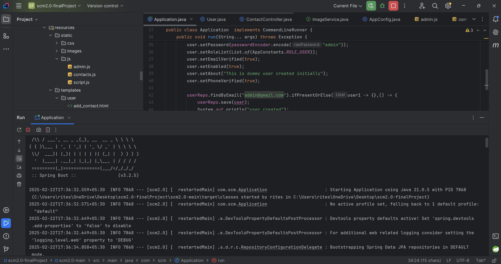
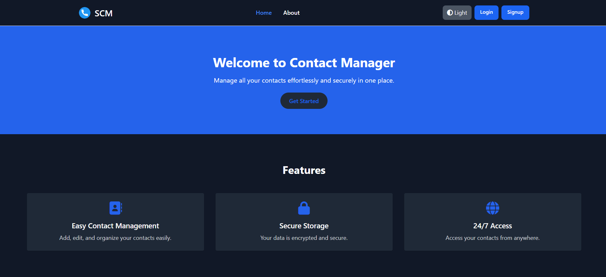
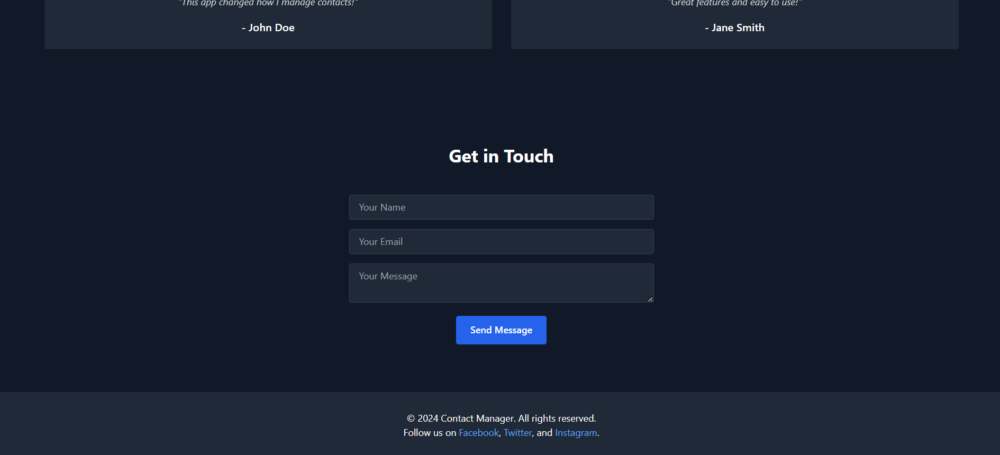
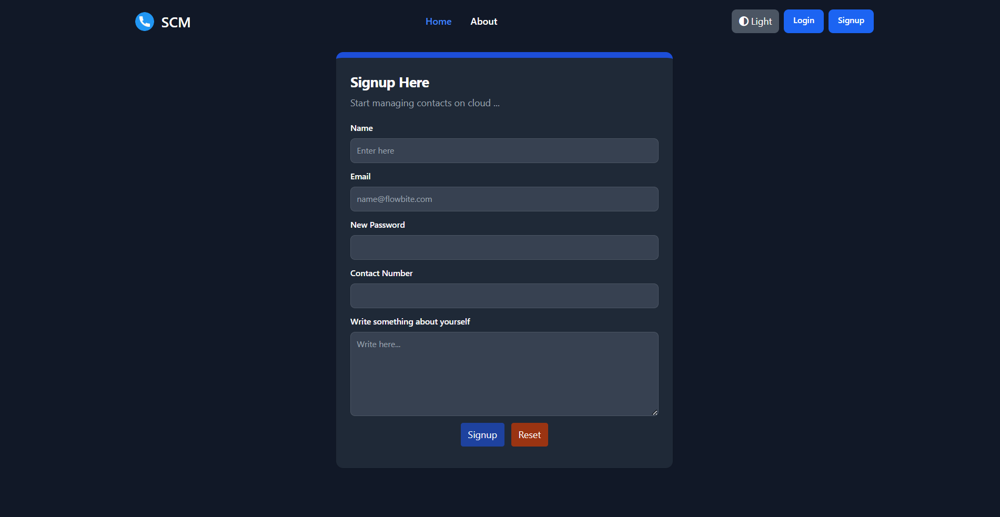
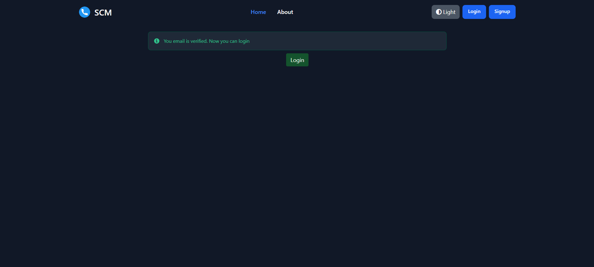
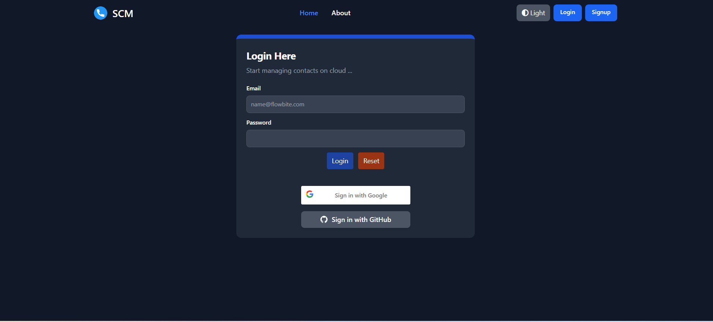
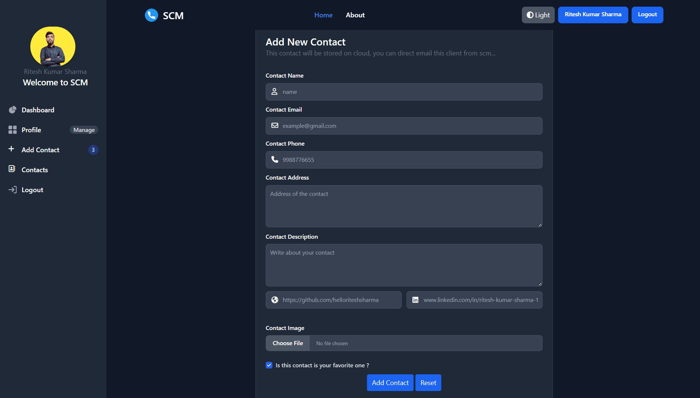
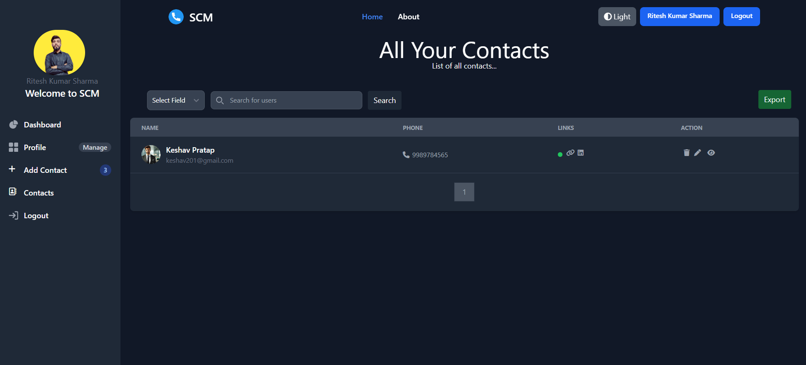

## Smart Contact Manager
Smart Contact Manager is a modern and feature-rich contact management system built with Spring Boot. It allows users to securely store, manage, and organize their contacts, offering functionalities like email verification, social login (Google & GitHub), cloud-based image storage, pagination, contact search, export to Excel, and theme customization. The platform ensures data security with Spring Security and provides a seamless user experience with Thymeleaf and Tailwind CSS.

## Tech Stack

**• Backend :** Java, Spring Boot, Spring MVC, Spring Security, Spring Data JPA, MySQL, Postman, Cloudinary, Docker, etc.

**• Frontend :** Thymeleaf, TailwindCSS, JavaScript, Flowbite, etc


## Table of Contents
- *Software and Tools required*  
- *Installation* 
- *Running the Project*    
- *API Endpoints*  
    - *Register User* 
    - *Login User* 
    - *User Dashboard* 
    - *User Profile* 
    - *Edit Contact* 
    - *Add Contact* 
    - *Contact* 
    - *Edit Contact* 
    - *Delete Contact* 
- *Snapshots* 

## Software and Tools required
- *JDK 17 or more*  
- *Git* 
- *MySQL Client* 
- *Docker* 
- *IDE or Editors* 
- *IntelliJ Idea (Community / Ultimate)* 
- *Spring Tool Suite (STS)* 
- *Eclipse*
- *Visual Studio Code (VS Code)*


## Installation

To install this application, run the following commands:

**Clone the project repository:**

```bash
  git clone https://github.com/helloriteshsharma/SmartContactManager.git
```
**Navigate to the project directory:**


```bash
  cd SmartContactManager
```

This will get a copy of the project installed locally. To configure all of its dependencies and start each app, follow the instructions below.

**Configure Database**

Once MySQL is installed you must configure a username and password. By default the user and password should be ```
  root``` 
 If not, you must configure in the file ```
  application.configure``` located in the path src/main/resources/.

In the file ```application.configure``` you must edit the parameters ```spring.datasource.username```  and  ```spring.datasource.password``` with the values you defined.

```bash
    server.port=8085

    spring.datasource.url=jdbc:mysql://localhost:3306/scmdb
    spring.datasource.driver-class-name=com.mysql.cj.jdbc.Driver
    spring.datasource.username=SQLUsername(i.e=root)
    spring.datasource.password=SQLUserPassword(i.e=root)

    spring.mail.host=${EMAIL_HOST}
    spring.mail.port=${EMAIL_PORT}
    spring.mail.username=${EMAIL_USERNAME}
    spring.mail.password=${EMAIL_PASSWORD}
    spring.mail.properties.mail.smtp.auth=true
    spring.mail.properties.mail.smtp.starttls.enable=true

    spring.security.oauth2.client.registration.google.client-id=${GOOGLE_CLIENT_ID}
    spring.security.oauth2.client.registration.google.client-secret=$   {GOOGLE_CLIENT_SECRET}
    spring.security.oauth2.client.registration.google.scope=email,profile

    spring.security.oauth2.client.registration.github.client-id=${GITHUB_CLIENT_ID}
    spring.security.oauth2.client.registration.github.client-secret=${GITHUB_CLIENT_SECRET}
    spring.security.oauth2.client.registration.github.scope=email,profile

    cloudinary.api.key=${CLOUDINARY_API_KEY}
    cloudinary.api.secret=${CLOUDINARY_API_SECRET}
    cloudinary.cloud.name=${CLOUDINARY_NAME}
```
**Build and run the Spring Boot application using CMD**

```bash
  mvnw spring-boot:run
```

**https://localhost:8085/**
## API Endpoints

#### ApiController

```http
GET     /api/contacts/{contactId}
```

#### AuthController

```http
GET     /auth/verify-email
```

#### ContactController

```http
GET    /user/contacts/add
```
```http
GET    /user/contacts 
```
```http
GET   /user/contacts/search
```
```http
GET   /user/contacts/delete/{contactId}
```
```http
GET  /user/contacts/view/{contactId}
```
```http
POST  /user/contacts/update/{contactId}
```
```http
POST  /user/contacts/add
```

#### PageController

```http
GET  /register
```
```http
GET  /login
```
```http
POST  /home
```
```http
POST  /about
```
```http
POST  /do-register
```


## Snapshots




















